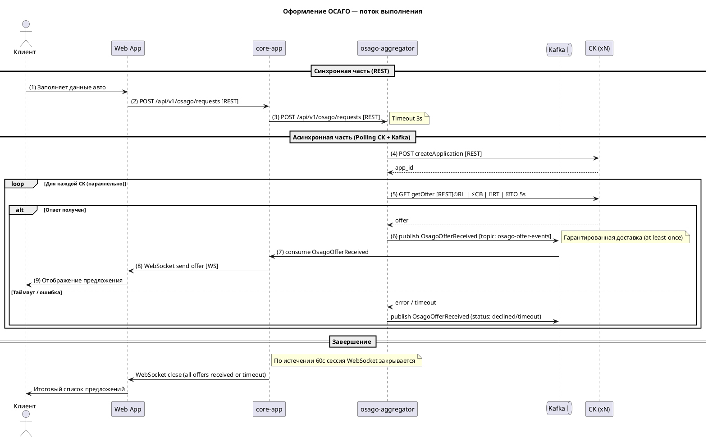

# Проектирование продажи ОСАГО — Архитектурные решения

## 1. Введение

Компания InsureTech запускает новый продукт — онлайн-оформление ОСАГО.
Пользовательский путь:
1. Клиент заполняет заявку с информацией об автомобиле (REST → core-app)
2. core-app отправляет запрос в osago-aggregator (REST)
3. osago-aggregator рассылает заявки во все страховые компании (REST)
4. По мере получения ответов от СК, предложения отображаются пользователю в реальном времени (WebSocket)
5. Максимальное время ожидания — 60 секунд

## 2. Сервис osago-aggregator

### 2.1. Назначение

Выделенный сервис для взаимодействия со страховыми компаниями по продукту ОСАГО.
Функциональные обязанности:
- Приём заявки от core-app
- Параллельная отправка заявок во все страховые компании (через REST API СК)
- Опрос решений по заявкам (polling с экспоненциальной задержкой)
- Публикация событий о полученных предложениях в Kafka
- Управление таймаутами и повторными попытками

### 2.2. Хранилище данных

**Решение: требуется собственная база данных (PostgreSQL).**

Обоснование:
- Каждая заявка порождает N асинхронных подзапросов к страховым компаниям (двухфазный протокол: createApplication → getOffer)
- Необходимо сохранять состояние каждого подзапроса на случай перезапуска сервиса
- Хранятся: входящие заявки, идентификаторы заявок в каждой СК, статусы опроса, полученные предложения, ошибки

| Таблица | Назначение |
|---|---|
| `osago_requests` | Входящие заявки от пользователей (данные авто, статус, таймстемпы) |
| `osago_insurance_subrequests` | Подзапросы к каждой СК (insurance_id, application_id, status, offer, error) |
| `osago_offers` | Полученные предложения (request_id, insurance_id, условия, премия) |

**Почему не Redis / временное хранилище:**
- Данные должны переживать перезапуски pod'ов (Kubernetes — ephemeral storage)
- Бизнес-требование: пользователь может обновить страницу и увидеть уже полученные предложения
- Единообразие с остальными сервисами архитектуры (все используют PostgreSQL)

### 2.3. API osago-aggregator → core-app

| Метод | Endpoint | Описание |
|---|---|---|
| REST POST | `/api/v1/osago/requests` | Создать заявку на ОСАГО. Тело: данные об автомобиле и водителе. Ответ: `request_id` |
| REST GET | `/api/v1/osago/requests/{id}/offers` | Получить все полученные предложения (для восстановления после переподключения WebSocket) |
| REST GET | `/api/v1/osago/requests/{id}/status` | Статус обработки заявки |

### 2.4. Интеграция core-app ↔ osago-aggregator

**Решение: REST + Event-Driven (Kafka).**

| Канал | Направление | Назначение |
|---|---|---|
| REST | core-app → osago-aggregator | Отправка заявки, получение статуса |
| Kafka (topic: `osago-offer-events`) | osago-aggregator → core-app | Потоковая публикация каждого полученного предложения |

**Почему не WebSocket между core-app и osago-aggregator:**
- При множестве экземпляров (multi-instance) WebSocket создаёт проблему аффинити — core-app должен подключиться к тому же pod'у osago-aggregator
- Kafka решает эту проблему через consumer groups: каждый экземпляр core-app может обработать любое событие
- Соответствует event-driven подходу, уже внедрённому в Task 3

**Событие OsagoOfferReceived:**
```json
{
  "event_id": "uuid",
  "event_type": "OsagoOfferReceived",
  "timestamp": "2025-01-15T10:30:00Z",
  "payload": {
    "request_id": "uuid",
    "insurance_company_id": "string",
    "application_id": "string",
    "offer": {
      "premium_amount": 15000.00,
      "coverage_details": {},
      "terms": {},
      "valid_until": "2025-01-16T10:30:00Z"
    },
    "status": "approved|declined|pending"
  }
}
```

## 3. Интеграция веб-приложения и core-app

### 3.1. API веб-приложения

| Метод | Endpoint | Протокол | Назначение |
|---|---|---|---|
| POST | `/api/v1/osago/requests` | REST | Отправка заявки на ОСАГО |
| WS | `/ws/osago/{request_id}` | WebSocket | Получение предложений в реальном времени |

### 3.2. Средство интеграции

**Решение: REST + WebSocket.**

- REST — для синхронных команд (отправить заявку, получить историю)
- WebSocket — для потоковой передачи предложений в браузер

При выборе WebSocket бизнес-требование "отображать предложения по мере поступления" реализуется нативно. Как только core-app получает событие `OsagoOfferReceived` из Kafka, оно отправляет сообщение в соответствующий WebSocket-сеанс.

**Почему не SSE (Server-Sent Events):**
- WebSocket поддерживает двустороннюю связь (потенциально полезно для отмены запроса, повторной отправки)
- WebSocket имеет лучшую поддержку в браузерах для долгоживущих соединений
- Однако SSE является допустимой альтернативой; выбор зависит от предпочтений команды

**Почему не Polling:**
- Polling не удовлетворяет требованию "отображать сразу, как только пришёл ответ"
- Создаёт избыточную нагрузку при 2500 одновременных пользователей

### 3.3. Масштабирование WebSocket (Multi-instance)

При множестве экземпляров core-app WebSocket-соединение устанавливается с конкретным pod'ом.
Для корректной доставки сообщений используются два подхода:

**Решение: Sticky Sessions (Session Affinity) на уровне Ingress + Redis Pub/Sub.**

1. Ingress Kubernetes настраивается на session affinity (на основе cookie или IP)
2. Все запросы одного пользователя направляются в тот же pod core-app
3. Для надёжности: Redis Pub/Sub — когда core-app получает событие из Kafka, оно публикует сообщение в Redis, и все экземпляры получают его; экземпляр, у которого есть соответствующий WebSocket-сеанс, отправляет сообщение клиенту

## 4. Паттерны отказоустойчивости

### Применение паттернов

| Паттерн | Где применён | Обоснование |
|---|---|---|
| **Rate Limiting** | osago-aggregator → страховые компании (исходящие вызовы) | 2500 одновременных пользователей × 10 СК = до 25000 RPS. Ограничение: не более 50 RPS на одну СК |
| **Rate Limiting** | core-app (WebSocket-соединения) | Не более 1 WebSocket-соединения на пользователя, не более 100 одновременных подключений с одного IP |
| **Circuit Breaker** | osago-aggregator → каждая страховая компания | Если СК недоступна или отвечает ошибками — разомкнуть цепь, не тратить ресурсы на повторные запросы. Время восстановления: 30 секунд |
| **Retry** | osago-aggregator → страховые компании (polling) | Экспоненциальная задержка (1с, 2с, 4с, 8с) до 3 попыток на каждый poll |
| **Timeout** | osago-aggregator → страховые компании | На каждый HTTP-вызов: 5 секунд. Общий таймаут на заявку: 60 секунд (бизнес-требование) |
| **Timeout** | core-app → osago-aggregator | REST-вызов: 3 секунды (синхронная часть). Kafka-события: без таймаута (асинхронно) |
| **Timeout** | core-app → браузер (WebSocket) | Если за 60 секунд не получено ни одного ответа — отправить сообщение "Время ожидания истекло" и закрыть соединение |

### Схема применения (на диаграмме)

Каждый паттерн отмечен на соответствующей стрелке-связи:
- ⏱ RL — Rate Limiting
- ⚡ CB — Circuit Breaker
- 🔄 RT — Retry
- ⏰ TO — Timeout

## 5. Диаграмма: изменения относительно Task 3

### Добавленные элементы

| Элемент | Тип | Расположение |
|---|---|---|
| osago-aggregator | Container (Kotlin, SpringBoot) | Между core-app и страховыми компаниями |
| PostgreSQL (osago-aggregator) | Database (PostgreSQL) | Под osago-aggregator |
| Kafka topic: `osago-offer-events` | Topic (добавлен в Kafka Cluster) | В составе Kafka Cluster |

### Добавленные связи

| От | К | Протокол | Назначение |
|---|---|---|---|
| Web App | core-app | **WebSocket** (NEW) | Потоковая передача предложений ОСАГО |
| core-app | osago-aggregator | REST | Отправка заявки, получение статуса |
| osago-aggregator | Kafka | Kafka Producer | Публикация `OsagoOfferReceived` |
| Kafka | core-app | Kafka Consumer | Подписка на `osago-offer-events` |
| osago-aggregator | Insurance Companies | REST | Создание заявок, получение предложений |
| osago-aggregator | PostgreSQL (osago) | TCP | CRUD заявок и предложений |

### Паттерны отказоустойчивости (на связях)

- RL ⏱ — osago-aggregator → Insurance Companies
- CB ⚡ — osago-aggregator → Insurance Companies
- RT 🔄 — osago-aggregator → Insurance Companies
- TO ⏰ — osago-aggregator → Insurance Companies, core-app → osago-aggregator, WebSocket (60s)

## 6. Поток выполнения (Sequence)



## 7. Обоснование выбора средств интеграции

| Интеграция | Выбор | Альтернативы | Почему выбрано |
|---|---|---|---|
| Web → core-app (команды) | REST | GraphQL, gRPC | REST уже используется в системе; команды простые (одна операция) |
| Web → core-app (события) | **WebSocket** | SSE, Polling, Long Polling | Требование реального времени; двусторонняя связь |
| core-app → osago-aggregator (команды) | REST | gRPC, Kafka Command | REST прост и соответствует подходу команд |
| osago-aggregator → core-app (события) | **Kafka** | WebSocket, gRPC Stream | Multi-instance safe; соответствует event-driven архитектуре Task 3 |
| osago-aggregator → СК | REST | GraphQL, SOAP | СК предоставляют REST API (по условию задачи) |
